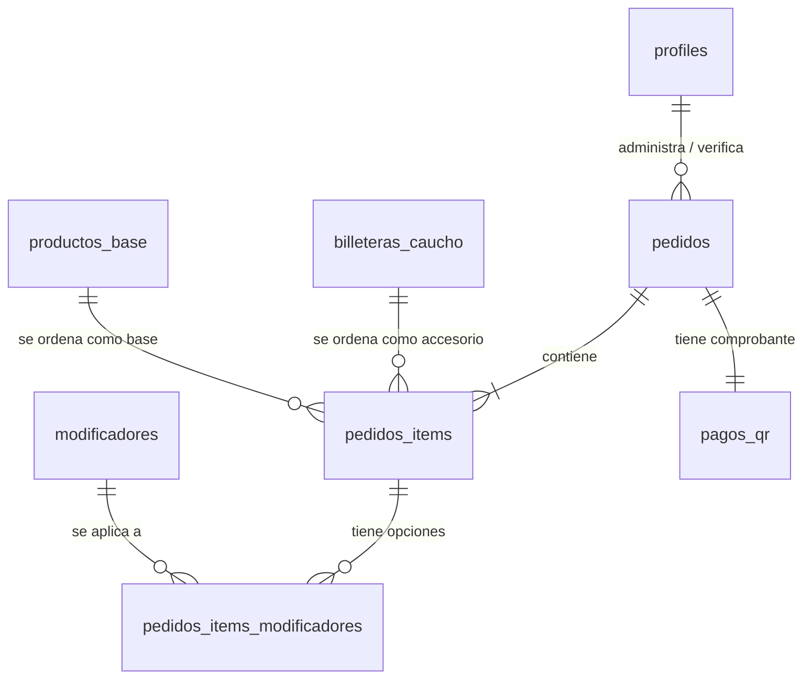
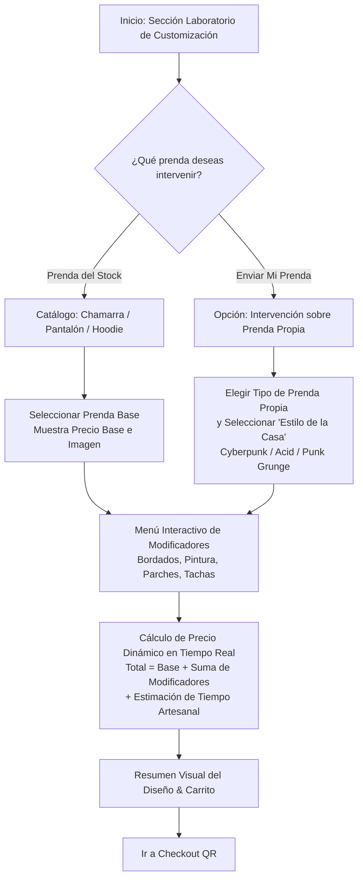
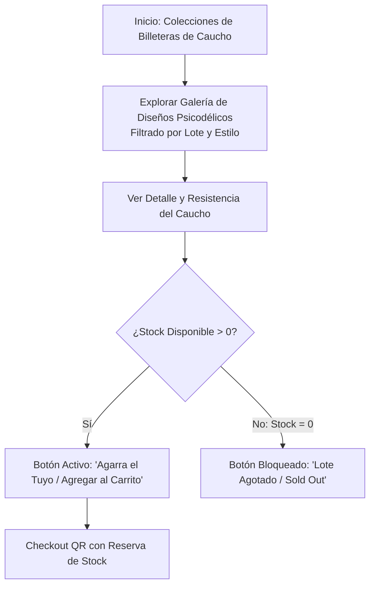
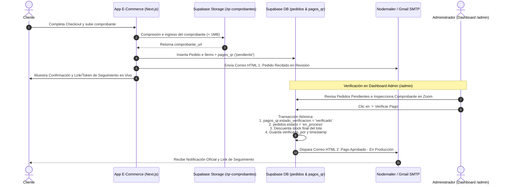

# DOCUMENTO MAESTRO DE ARQUITECTURA TÉCNICA, FLUJOS Y ROADMAP
## Plataforma E-Commerce: Upcycling & Custom Shop ("Laboratorio de Customización & Accesorios Reciclados")
### Directriz Maestro: Antigravity Core 2.0 (Blindado para Producción)

---

## 1. RESUMEN EJECUTIVO DEL MODELO DE NEGOCIO

La plataforma opera bajo el concepto de **"Laboratorio de Customización Digital & Boutique Sostenible"**, especializada en dar una segunda vida a prendas y materiales reciclados de alta resistencia mediante diseño de autor y técnicas artesanales (upcycling). 

El modelo de negocio se divide en dos grandes líneas productivas y de experiencia de usuario:

1. **Ropa Customizada (Custom Shop & Upcycling Lab):**
   - **Línea A (Prendas Base del Inventario):** El usuario selecciona una prenda base vintage o de segunda mano curada (chamarras de mezclilla, pantalones, chalecos, hoodies) disponible en el stock propio de la tienda y le añade modificadores personalizados (bordados, pintura textil, parches psicodélicos, tachas, desgarros) a través de un configurador interactivo con cálculo de precio en tiempo real.
   - **Línea B (Prenda Propia del Cliente):** El cliente envía o entrega su propia prenda a la tienda para ser intervenida bajo el sello y **"Estilo de la Casa"**, seleccionando una temática o directriz artística visual desde el configurador.

2. **Billeteras Recicladas de Cámaras de Bici (Accesorios de Alta Resistencia):**
   - Fabricadas con caucho reciclado de cámaras de neumático de bicicleta, ofreciendo impermeabilidad, durabilidad extrema y estética industrial/urbana.
   - Intervenidas con diseños psicodélicos exclusivos, vendidas por **lotes o colecciones de stock limitado**. Control atomizado de stock en tiempo real con bloqueo automático de compra cuando se agota.

---

## 2. ARQUITECTURA DE BASE DE DATOS (SUPABASE / POSTGRESQL & RLS)

El modelo relacional está diseñado para soportar un inventario mixto (ítems únicos configurables, ítems de stock por lotes y recepción de ítems externos) junto con un flujo de pedidos con trazabilidad financiera y comprobantes QR en almacenamiento en la nube.

### 2.1 Esquema Relacional Completo & Estricto (SQL)

#### A. `profiles` (Roles y Seguridad de Usuarios)
| Columna | Tipo de Dato | Restricciones | Descripción |
| :--- | :--- | :--- | :--- |
| `id` | `UUID` | `PK, FK -> auth.users(id) ON DELETE CASCADE` | ID del usuario autenticado en Supabase |
| `email` | `TEXT` | `NOT NULL, UNIQUE` | Correo del usuario |
| `full_name` | `TEXT` | `NULLABLE` | Nombre completo |
| `role` | `TEXT` | `NOT NULL, DEFAULT 'client'` | Enum (`client`, `admin`) para control RLS |
| `created_at`| `TIMESTAMPTZ`| `DEFAULT now()` | Timestamp de registro |

#### B. `productos_base` (Catálogo de Ropa en Stock para Customizar)
| Columna | Tipo de Dato | Restricciones | Descripción |
| :--- | :--- | :--- | :--- |
| `id` | `UUID` | `PK, DEFAULT gen_random_uuid()` | Identificador único de la prenda base |
| `nombre` | `TEXT` | `NOT NULL` | Nombre descriptivo (ej: *Chamarra Denim Vintage 90s*) |
| `tipo` | `TEXT` | `NOT NULL` | Categoría (`chamarra`, `pantalon`, `chaleco`, `hoodie`) |
| `talla` | `TEXT` | `NOT NULL` | Talla única o estándar (`S`, `M`, `L`, `XL`, `Oversize`) |
| `precio_base` | `DECIMAL(10,2)`| `NOT NULL, CHECK (precio_base >= 0)` | Precio inicial antes de modificadores |
| `stock` | `INTEGER` | `NOT NULL, DEFAULT 1` | Cantidad disponible (generalmente piezas únicas = 1) |
| `imagen_url` | `TEXT` | `NOT NULL` | URL de la imagen principal en Supabase Storage |
| `galeria_urls` | `TEXT[]` | `DEFAULT '{}'` | Array de imágenes complementarias de la prenda |
| `is_active` | `BOOLEAN` | `DEFAULT true` | Estado de visibilidad en el catálogo en vivo |
| `created_at` | `TIMESTAMPTZ`| `DEFAULT now()` | Fecha de registro en inventario |

#### C. `modificadores` (Catálogo de Intervenciones Artísticas)
| Columna | Tipo de Dato | Restricciones | Descripción |
| :--- | :--- | :--- | :--- |
| `id` | `UUID` | `PK, DEFAULT gen_random_uuid()` | Identificador del modificador |
| `nombre` | `TEXT` | `NOT NULL` | Nombre (ej: *Bordado Dorsal Dragón*, *Pintura Neón Acrílica*) |
| `categoria` | `TEXT` | `NOT NULL` | Tipo (`bordado`, `pintura`, `parches`, `herrajes`, `distress`) |
| `precio_extra` | `DECIMAL(10,2)`| `NOT NULL, DEFAULT 0` | Costo adicional que suma al total |
| `imagen_referencia`| `TEXT` | `NULLABLE` | Icono o foto de muestra del acabado artístico |
| `is_active` | `BOOLEAN` | `DEFAULT true` | Disponible para ser seleccionado por clientes |

#### D. `billeteras_caucho` (Catálogo de Accesorios Reciclados)
| Columna | Tipo de Dato | Restricciones | Descripción |
| :--- | :--- | :--- | :--- |
| `id` | `UUID` | `PK, DEFAULT gen_random_uuid()` | Identificador de la billetera o modelo |
| `nombre_diseno`| `TEXT` | `NOT NULL` | Nombre de la colección/diseño (ej: *Cyberpunk Acid Rubber*) |
| `lote` | `TEXT` | `NOT NULL` | Código o número de lote exclusivo (`LOTE-01-2026`) |
| `precio_fijo` | `DECIMAL(10,2)`| `NOT NULL, CHECK (precio_fijo >= 0)`| Precio de venta directo |
| `stock_disponible`| `INTEGER` | `NOT NULL, CHECK (stock_disponible >= 0)`| Stock en tiempo real. Si llega a 0, cambia a "Agotado" |
| `imagen_url` | `TEXT` | `NOT NULL` | Foto principal del producto en caucho |
| `galeria_urls` | `TEXT[]` | `DEFAULT '{}'` | Vistas del interior, costuras y diseño psicodélico |
| `is_active` | `BOOLEAN` | `DEFAULT true` | Visibilidad en tienda |

#### E. `pedidos` (Cabecera General del Pedido)
| Columna | Tipo de Dato | Restricciones | Descripción |
| :--- | :--- | :--- | :--- |
| `id` | `UUID` | `PK, DEFAULT gen_random_uuid()` | Identificador único del pedido |
| `token_acceso`| `UUID` | `NOT NULL, DEFAULT gen_random_uuid(), UNIQUE` | Token de seguridad para seguimiento público |
| `cliente_nombre` | `TEXT` | `NOT NULL` | Nombre completo del comprador |
| `correo` | `TEXT` | `NOT NULL` | Correo electrónico de contacto |
| `telefono` | `TEXT` | `NOT NULL` | Teléfono / WhatsApp para coordinación de entregas |
| `direccion_envio`| `TEXT` | `NOT NULL` | Dirección completa o sucursal de recojo |
| `tipo_pedido` | `TEXT` | `NOT NULL` | Enum (`ropa_stock`, `ropa_propia`, `billetera`, `mixto`) |
| `tematica_prenda_propia` | `TEXT` | `NULLABLE` | Si es prenda propia: *Estilo Cyberpunk, Psicodélico, etc.* |
| `notas_cliente` | `TEXT` | `NULLABLE` | Instrucciones especiales, detalles de medidas o colores |
| `total` | `DECIMAL(10,2)`| `NOT NULL, CHECK (total >= 0)` | Monto final calculado a pagar |
| `estado` | `TEXT` | `NOT NULL, DEFAULT 'pendiente_pago'` | Enum: `pendiente_pago`, `en_verificacion`, `en_proceso`, `enviado`, `completado`, `cancelado` |
| `created_at` | `TIMESTAMPTZ`| `DEFAULT now()` | Fecha y hora del pedido |

#### F. `pedidos_items` & `pedidos_items_modificadores` (Detalle Relacional del Carrito)
- **`pedidos_items`**: Relaciona el `pedido_id` con `producto_base_id` o `billetera_id`, indicando cantidad, precio unitario y subtotal.
- **`pedidos_items_modificadores`**: Tabla intermedia que enlaza un `pedido_item_id` (de tipo ropa) con cada `modificador_id` seleccionado, congelando el `precio_extra` en el momento de la compra.

#### G. `pagos_qr` (Control Contable y Verificación Manual - Estilo BarberWeb)
| Columna | Tipo de Dato | Restricciones | Descripción |
| :--- | :--- | :--- | :--- |
| `id` | `UUID` | `PK, DEFAULT gen_random_uuid()` | Identificador del registro de pago |
| `pedido_id` | `UUID` | `FK -> pedidos(id) ON DELETE CASCADE, UNIQUE` | Relación 1 a 1 con el pedido |
| `monto_pagado` | `DECIMAL(10,2)`| `NOT NULL` | Monto transferido por el cliente según comprobante |
| `comprobante_url`| `TEXT` | `NOT NULL` | URL de la captura subida a Supabase Storage (`/qr-comprobantes`) |
| `estado_verificacion`| `TEXT` | `NOT NULL, DEFAULT 'pendiente'` | Enum: `pendiente`, `verificado`, `rechazado` |
| `verificado_por` | `UUID` | `FK -> auth.users(id), NULLABLE` | ID del administrador que auditó y aprobó la captura |
| `verificado_en` | `TIMESTAMPTZ`| `NULLABLE` | Timestamp exacto de la aprobación/rechazo por admin |
| `notas_revision` | `TEXT` | `NULLABLE` | Razón de rechazo (ej: *Comprobante borroso o monto inferior*) |
| `created_at` | `TIMESTAMPTZ`| `DEFAULT now()` | Fecha de subida del comprobante |

---

### 2.2 Políticas de Seguridad Blindadas (Row-Level Security - RLS)

Se activará RLS estricto (`ALTER TABLE <tabla> ENABLE ROW LEVEL SECURITY;`) en todas las tablas sin excepción:

1. **Catálogo (`productos_base`, `modificadores`, `billeteras_caucho`):**
   - **SELECT (Lectura Pública):** Permitido solo para registros con `is_active = true`.
   - **ALL (CRUD completo):** Exclusivo para usuarios con `profiles.role = 'admin'`.

2. **Pedir & Pagar (`pedidos`, `pedidos_items`, `pedidos_items_modificadores`, `pagos_qr`):**
   - **INSERT:** Permitido al público general (anónimo o autenticado) durante el Checkout.
   - **SELECT:** 
     - **Admin:** Acceso total.
     - **Cliente:** Acceso restringido por `token_acceso` en la URL (`/pedido/[token]`) para evitar exposición del historial general.
   - **UPDATE / DELETE:** Exclusivo para usuarios con rol `admin`.

---

## 3. FLUJO DE EXPERIENCIA DEL USUARIO (UX/UI) & SUTILEZAS DE PRODUCCIÓN

### 3.1 Flujo de Customización ("Laboratorio Interactivo")

1. **Cotizador Reactivo:** Al seleccionar/deseleccionar modificadores, el precio total, la lista de extras en el canvas del diseño y el tiempo estimado de confección se actualizan de forma instantánea y fluida.
2. **Compresión Inteligente:** Al subir el comprobante en el modal de pago QR (`input type="file"`), la imagen se redimensiona y comprime automáticamente a < 1 MB antes del upload a Storage.

---

### 3.2 Flujo de Billeteras de Caucho Reciclado

1. **Badges de Escasez y Sold Out Automático:** Si `stock_disponible <= 3`, parpadea la alerta neón *"🔥 Últimas piezas en stock"*. Si el stock llega a 0, la tarjeta adopta una textura oscura carbonizada con sello **"AGOTADO"**.

---

## 4. FLUJO DE PAGOS, PANEL ADMIN & CORREOS HTML

### 4.1 Panel de Administración Protegido (`/admin`)
- **Acceso Restringido:** Autenticado vía Supabase Auth + Verificación de Rol en la tabla `profiles` (`role = 'admin'`).
- **Inspección Visual 1-Clic:** Previsualización del comprobante bancario del cliente en modal con zoom, contrastando el monto pagado vs. total del pedido.
- **Gestión Básica de Stock:** Panel para sumar o restar existencias de lotes de billeteras o prendas base vintage.

### 4.2 Sistema de Correos (Nodemailer + Plantillas HTML Dark & Neon)
- **Manejo Asíncrono Resiliente:** Si el servidor SMTP de Gmail tarda en responder o si se excede la cuota temporal, el pedido no se bloquea en la UI del cliente; se guarda en la base de datos y se reintenta/registra en el servidor.
- **Plantillas HTML Premium:** Incluyen el logotipo del Laboratorio de Customización, la tabla con el desglose de ítems e intervenciones artísticas, y el botón de seguimiento en vivo.

---

## 5. STACK TECNOLÓGICO & DESIGN SYSTEM

- **Frontend:** Next.js (App Router, TypeScript, Tailwind CSS, Lucide Icons).
- **Backend/BaaS:** Supabase (PostgreSQL, RLS estricto, Storage, Auth JWT).
- **Notificaciones:** Node.js Nodemailer + Gmail App Passwords + Plantillas HTML responsive.
- **Tipado & Seguridad de Producción:** Zod para validación de variables (`src/lib/env.ts`) y compresión de imágenes en el cliente (`uploadImage`).
- **Paleta Dark Matte & Neon:**
  - Fondo: `#0A0A0C` (Negro Carbón Mate) / `#131316` (Obsidiana).
  - Acentos Neón: `#F59E0B` (Ámbar Industrial / Precios en Vivo), `#10B981` (Verde Ácido / Stock disponible / Confirmación), `#8B5CF6` (Púrpura UV / Customización / Lotes especiales).
